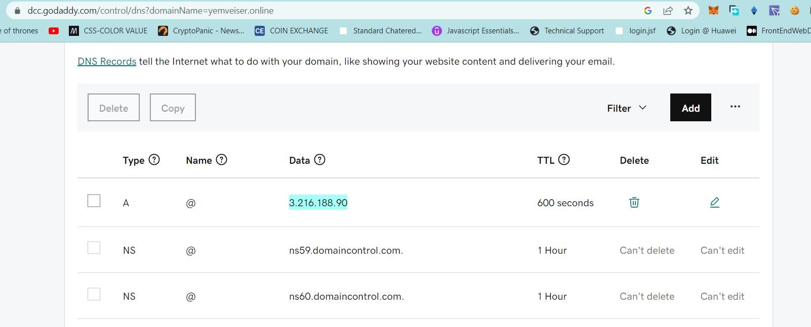

## ......................................CONFIGURE NGINX AS A LOAD BALANCER...............................
Create an EC2 VM based on Ubuntu Server 20.04 LTS and name it Nginx LB (do not forget to open TCP port 80 for HTTP connections, also open TCP port 443 – this port is used for secured HTTPS connections)

Update ``/etc/hosts`` file for local DNS with Web Servers’ names (e.g. Web1 and Web2) and their local IP addresses


Install and configure Nginx as a load balancer to point traffic to the resolvable DNS names of the webservers
Lets Update the instance and Install Nginx
```
sudo apt update -y
sudo apt install nginx
```

**Configure Nginx LB using Web Servers’ names defined in /etc/hosts**

Open the default nginx configuration file
`sudo vi /etc/nginx/nginx.conf` and insert the below configuration.

```
#insert following configuration into http section

 upstream myproject {
    server Web1 weight=5;
    server Web2 weight=5;
  }

server {
    listen 80;
    server_name www.domain.com;
    location / {
      proxy_pass http://myproject;
    }
  }

#comment out this line
#       include /etc/nginx/sites-enabled/*;
```

Restart the nginx service.

```
sudo systemctl restart nginx
sudo systemctl status nginx
```


** ........................REGISTER A NEW DOMAIN NAME AND CONFIGURE SECURED CONNECTION USING SSL/TLS CERTIFICATES................

Let us make necessary configurations to make connections to our Tooling Web Solution secured!

In order to get a valid SSL certificate – you need to register a new domain name, you can do it using any Domain name registrar – a company that manages reservation of domain names. The most popular ones are: [Godaddy.com](https://www.godaddy.com/), [Domain.com](https://www.domain.com/).

Register a new domain name with any registrar of your choice in any domain zone (e.g. .com, .net, .org, .edu, .info, .xyz or any other)

Assign an Elastic IP to your Nginx LB server and associate your domain name with this Elastic IP


Update A record in your registrar to point to Nginx LB using Elastic IP address.



Check that your Web Servers can be reached from your browser using new domain name using HTTP protocol – http://<your-domain-name.com>


Configure Nginx to recognize your new domain name
Update your nginx.conf with server_name www.<your-domain-name.com> instead of server_name www.domain.com


Install certbot and request for an SSL/TLS certificate
Make sure snapd service is active and running

``sudo apt install snap -y ``


Now Install certbot

``sudo snap install ==classic certbot


```
sudo ln -s /snap/bin/certbot /usr/bin/certbot
sudo certbot --nginx
```


Test secured access to your Web Solution by trying to reach https://<your-domain-name.com>


If you are unable to access the site using https, please check the security group of the Nginx Loadbalancer and ensure port 443 is allowed. in my case i forgot to allow it, hence the reason i get the initial error.


now we can try and access out site using https.


Set up periodical renewal of your SSL/TLS certificate
By default, LetsEncrypt certificate is valid for 90 days, so it is recommended to renew it at least every 60 days or more frequently.

Lets test renewal command in dry-run mode

``sudo certbot renew --dry-run``

Let us configure a cronjob to run the command twice a day.

To do so, lets edit the crontab file with the following command:

``crontab -e ``
```
* */12 * * *   root /usr/bin/certbot renew > /dev/null 2>&1
```

Congratulations!
We have just implemented an Nginx Load Balancing Web Solution with secured HTTPS connection with periodically updated SSL/TLS certificates.